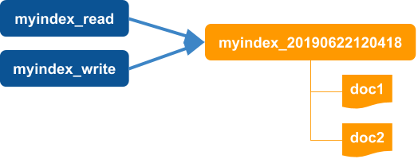
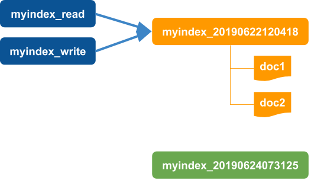
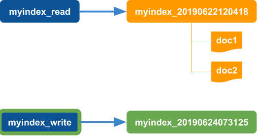
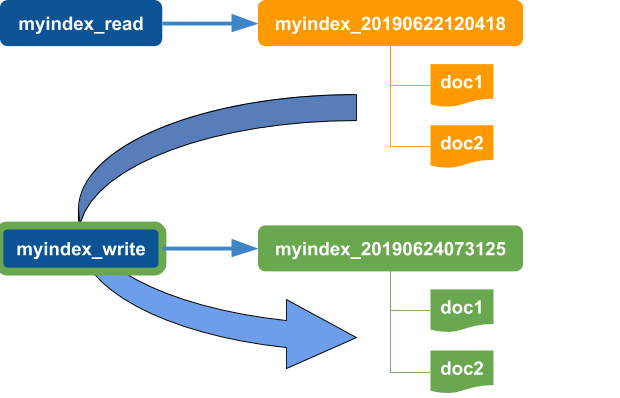
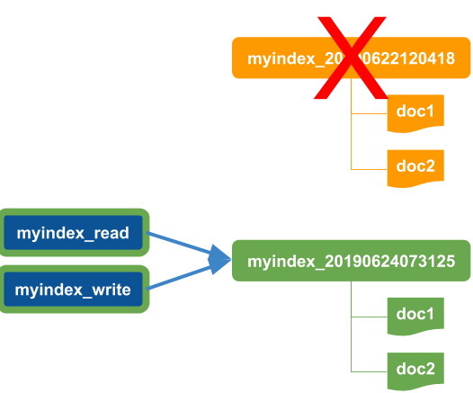
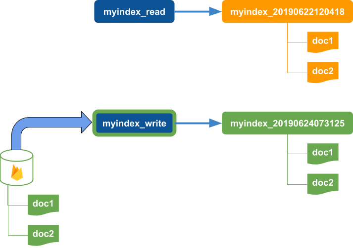

# Cloudli - [](http://makeapullrequest.com) [](https://github.com/your/your-project/blob/master/LICENSE)

## Command Line Utilities for Google Firebase Firestore and Amazon Elasticsearch

[Upload](#fireupload), [Backup](#firebackup), [Restore](#firerestore), [Diff](#firediff), [Validate](#firevalidate), [Search](#essearch), [Load Index](#esload-index), [Reindex](#esreindex), and more.

Provides command line functions for administering Google Cloud Firestore and Amazon Elasticsearch.

The commands are designed to be scalable by processing in batches where appropriate 
and controlling concurrency with various constraints.  The batch delete code from 
[firebase-tools](https://github.com/firebase/firebase-tools/blob/master/src/firestore/delete.js) was used as a basis for the firestore document hierarchy traversal and
batch processing.  [RxJS](https://github.com/ReactiveX/rxjs) was used for the restore 
command to provide similar batch concurrency control for file directory traversal and processing.

Cloudli supports the following [Cloud Firestore](#Cloud-Firestore) commands:

Function|Description
--------|-----------
[Get Documents](#firedocs)|Get document id's or full documents from firestore with various query options
[Get Document or Collection](#fireget)|Gets document id's or full documents for a specific document or collection path
[Backup](#fire:backup)|Backup documents to a local path
[Restore](#fire:restore)|Restore documents from a local path to firestore.  Alias of `fire:upload`
[Upload](#fire:upload)|Upload documents from a local path to firestore. Alias of `fire:restore`
[Delete](#fire:delete)|Backup and delete documents from firestore
[Diff](#fire:diff)|Compare firestore documents to local document files. Display results on command line or in html.
[Validate](#fire:validate)|Validate firestore documents using [JSON Schema](https://json-schema.org/) definitions

Cloudli supports the following [Amazon Elasticsearch](#Elasticsearch) commands:

Function|Description
--------|-----------
[Create Index](#es:create-index)|Create an index from a mapping with optional aliases
[Get Aliases](#es:get-aliases)|Get the index name for the read and write aliases
[Load Index](#es:load-index)|Load an index from a set of documents in firestore
[Search](#es:search)|Searches for text in a defined index with optional highlighting
[Reindex](#es:reindex)|Reindex documents to a new index mapping and adjust read and write aliases
[Create Index and Reload](#es:create-reload-index)|Create a new index mapping, reload documents from firestore and adjust read and write aliases

**Note**: Cloud Firestore and Elasticsearch commands can be used independently (with the exception of [Load Index](#es:load-index) and [Create Index and Reload](#es:create-reload-index), which index documents from firestore).

## Motivation

While working with Google Cloud FIrestore, I found myself manually updating firestore documents as code evolved.  I needed to update existing documents as the implied schemas evolved. Finding the documents to update became a challenge.  I also needed a way to see changes that have occurred.

When I added search using Amazon Elasticsearch along with Firebase Cloud Functions, I needed to be able to update the index mappings and reindex documents.  In some cases, I wanted to discard the original indexed documents and reindex from the Firestore source documents.

The need to simplify these tasks led to the creation of this tool.  It has improved my productivity and I hope others will find it useful.

## Goals

Some of the goals for this tool are:

- Simplify common administrative tasks for cloud-based capabilities (initially Cloud Firestore and Amazon Elasticsearch)
- Scale by controlling resource consumption (memory, recursion, batch size, etc)
- Generalize the implementation to support other document structures, schemas, and index mappings
- Support extensible logging and debugging

## Getting Started

To install cloudli:

```
$ yarn global install cloudli
```
-- or --
```
$ npm install -g cloudli
```

## Example Directory

The [example directory](example) contains sample configuration, documents, index mappings, and JSON schemas that can be used to try out the commands.  The example uses documents in the following structure:

```
─ xyzposts          // contains public "post" documents
─ xyzusers          // contains "user" documents
    ├── user1
    │   └── posts   // contains user 1 "post" documents
    └── user2
        └── posts   // contains user 1 "post" documents
```

Index mappings [example/elasticsearch/indexMappings](example/elasticsearch/indexMappings) and JSON Schemas [example/schemas](example/schemas) are provided for `user` and `post` documents.

You can use the example with a test firestore database and/or a test Amazon elesticsearch instance. To use the examples, set up the key configuration in [Configuration](#Configuration) and then follow the example commands [here](docs/example.md).

### Configuration

Cloudli requires administration account access to use Cloud Firestore and Amazon Elasticsearch commands.

To use Cloud Firestore commands, firebase configuration, including a firebase key file is required.  To use elasticsearch commands, elasticsearch configuration, including a service account file is required.

To use any of the elasticsearch commands, a service account file must be supplied in the `elasticsearch.serviceAccountFilename` config entry.  

Since these files are usually environment-specific, the configuration can be included in a `local-development.json` file in the config directory (or similar files for other environments).  You should include `/config/local*` in the `.gitignore` file in the root of your project. An example local-development.json file is supplied in [example/config](example/config/example-local-development.json):

```javascript
/**
 * Example of putting sensitive, environment-specific information in a local-development config file
 * 
 * Rename this to local-development (or local-environmentname) and fill in details.
 * 
 * Keyfile and service account files could be stored in a ./keys folder or other protected location.
 * The .keys path should also be added to .gitignore so that the files are not added to source control.
 */
{
  // Required for firebase commands (and es:load-index and es:create-index-reload)
  "firebase": {
    "keyFilename": "path-to-your-project-firebase-adminsdk-keyfile.json",
    "databaseURL": "https://your-project-database-url.com",
    "projectId": "your-projectid"
  },

  // Required for elasticsearch commands
  "elasticsearch": {
    "serviceAccountFilename": "path-to-your-elasticsearch-service-account-file.json"
  }
}
```

Copy the `example/config/example-local-development.json` file to `local-development.json` and fill in the details for firestore, elasticsearch, or both.  Include the firestore keyfile path in `keyFilename`.  Include the elasticsearch service account file path in `serviceAccountFilename`.

The elasticsearch `serviceAccountFilename` file has the following format:

```javascript
{
  "region": "<region>",
  "domain": "<domain>",
  "id": "<aws id>",
  "key": "<aws access key>"
}
```

See [Amazon Elasticsearch Service Access Control](https://docs.aws.amazon.com/elasticsearch-service/latest/developerguide/es-ac.html#es-ac-types-identity) and [Managing Access Keys for IAM Users](https://docs.aws.amazon.com/IAM/latest/UserGuide/id_credentials_access-keys.html) for additional details on Amazon Elasticsearch security configuration.

See [Generate a private key file](https://firebase.google.com/docs/admin/setup#initialize_the_sdk) for details on creating an admin key file for Firestore.

### Configuration Files

Cloudli uses [config](https://github.com/lorenwest/node-config) for command configuration.  The default configuration file will be loaded from [config/default.json](config/default.json). 

The `NODE_ENV` environment variable can be changed to use different configuration files. For example, to load the configuration files for production from the file `config/production.json`, set the `NODE_ENV` as follows:

```
$ export NODE_ENV=production
```

If not specified, the dafult for `NODE_ENV` is `development`.  

Note that `default.json` is loaded for all environments and merged with the environment-specific (and local) config files.  This allows configuration settings that are not environment-specific to be defined in one file and environment-specific settings to loaded from environment-specific files.

### Commands

Cloudli uses subcommands for firestore and elasticsearch commands.  Firestore commands have a `fire:` prefix and elasticsearch commands have a `es:` prefix.

Usage: 
```
$ cloudli [<subcommand> [<subcommand options> [--help]]] | --version | --help
```

To get cloudli help, use:

```
cloudli --help
```

To get detailed help for a specific command, use `cloudli <command> --help`.  For example:

```
cloudli fire:docs --help
```

## Logging

Cloudli logging uses pino:  https://github.com/pinojs/pino

Set log level using the `LEVEL` environment variable:

```
$ export LEVEL=info
```

The default level is `info`.
Available levels are: 
- `fatal`
- `error`
- `warn`
- `info`
- `debug`
- `trace`
- `silent`

### Console Output

Output displayed on the interactive console will be displayed with colors and without timestamps by default.  To have console output in pino (json) format, add the following in config:

```javascript
  "logger": {
    "prettyPrint": false
  },
```

Note that even with prettyPrint set to false, redirected output will be in pino (json) format.  This output can be piped to [pino-pretty](https://github.com/pinojs/pino-pretty), [pino-colada](https://github.com/lrlna/pino-colada) or pino [transports]( https://github.com/pinojs/pino/blob/master/docs/transports.md).

For example, to use pino-colada:

```
$ cloudli fire:docs -p col1 -s | pino-colada
```

## Debug Support
Cloudli supports debug logging using the debug package (https://github.com/visionmedia/debug).

Enable debug logging using:

```
$ export DEBUG=*
```

To filter debug modules:

- For all cloudli modules debug:  

    ```$ export DEBUG=cloudli:*```

- For specific cloudli module debug (example):  

    ```$ export DEBUG=cloudli:traverseBatch```

**Note**: `LEVEL` must be set to `debug` or higher for debug messages to be included.

Modules with debug:

- `cloudli:delete`
- `cloudli:restore`
- `cloudli:traverseBatch`
- `cloudli:elasticsearch`

# Cloud Firestore

Cloudli supports commands for Google Cloud Firestore, including:

Function|Description
--------|-----------
[Get Documents](#fire:docs)|Get document id's or full documents from firestore with various query options
[Get Document or Collection](#fire:get)|Gets document id's or full documents for a specific document or collection path
[Backup](#fire:backup)|Backup documents to a local path
[Restore](#fire:restore)|Restore documents from a local path to firestore.  Alias of `fire:upload`
[Upload](#fire:upload)|Upload documents from a local path to firestore. Alias of `fire:restore`
[Delete](#fire:delete)|Backup and delete documents from firestore
[Diff](#fire:diff)|Compare firestore documents to local document files. Display results on command line or in html.
[Validate](#fire:validate)|Validate firestore documents using [JSON Schema](https://json-schema.org/) definitions

## Document Selection

Cloud firestore commands support various options for selecting documents.  To support scalability, 
a [StructuredQuery](https://cloud.google.com/firestore/docs/reference/rest/v1/StructuredQuery) is used internally to select documents in batches.  This approach does constrain document selection.  For example, there is no direct way to perform a regular expression-like filtered query of document paths against firestore. However, several options are available to address most scenarios.  For example, using a recursive selection from a starting collection path combined with a defined `collectionId` for a sub-collection allows for selection of sub-collections across a sub-tree in the database.

To simplify the use of multiple selection options, [Document Sets](#Document-Sets-(DocSets)) may be defined in the configuration file and used in commands (see [below](#Document-Sets-(DocSets))).

The options available for document selection are:

|Option                           |Description|Notes|
|---------------------------------|-----------|-----|
|`-p, --path <path>`|The base path of the documents|May be a collection or document. If not specified, will include all root collections.|
|`-r, --recursive`|Includes all documents under `path` recursively|Cannot be used with `--shallow`.  One of `--recursive` or `--shallow` must be specified if `path` is a collection.
|`-s, --shallow`|Includes only documents in the collection if `path` is a collection or the documents in the collections directly under the document if `path` is a document|Cannot be used with `--recursive`.  One of `--recursive` or `--shallow` must be specified if `path` is a collection.
|`-c, --collectionId <id>`|Only include documents in collections with name of `id`|
|`-f, --filter <regex>`|Filter results to paths that match the supplied regular expression `regex`|This filter is applied after results are received from the query before processing a document so consider performance and load when using `--filter`. For best results, use `--path` and `--collectionId` to filter the query and then apply `--filter`. Cannot be used with `--idfilter`
|`-i, --idfilter <id>`|Filter results to documents with `id`| This is a special case of `--filter`. Cannot be used with `--filter`.|
|`-m, --min`|Limit results to include only document id and path|Useful when previewing results|

### Document Sets (DocSets)

Document Sets ("`DocSet`") are shorthand references to sets of documents.  DocSets define selection crieria for easy reference when using firestore commands.  DocSets are defined in the configuration file.

Consider a document hierarchy as follows:

```
users
  - user1
    - posts
      - user1post1
      - user1post2
    - addresses
      - address1
      - address2
  - user2
    - posts
      - user2post1
      - user2post2
    - addresses
      - address 1
regions
  - region1
  - region2
```

To define a DocSet for posts for all users, the following configuration can be used:

```javascript
"firestore": {
  "docSets": {
    "userPosts": {
      "path": "users",
      "collectionId": "posts",
      "recursive": true
    }
  }
}
```

In this example, `userPosts` is the name of the DocSet.  This name can be used in commands.  For example, to list the paths for all user post documents:

```
$ cloudli fire:docs userPosts
```

To display the full documents for all of the user posts:

```
$ cloudli fire:docs userPosts --verbose
```

# Cloud Firestore Commands

The following sections provide details of the available commands for Cloud Firestore.

## fire:docs

```
fire:docs [docSetId]
```
Gets firestore documents with an optional `docSetId`.  If docSetId is not specified and no other selection options are supplied, will include all documents in the database. The specified `docSetId` must be defined in config (see [above](#Document-Sets-(DocSets))).  

### Options

See [Document Selection](#Document-Selection) for details on selection options.

#### Additional Options

|Option|Description|
|------|-----------|
|`-v, --verbose`|Includes full document content in results|


## fire:get

```
fire:get <path>
```
Gets firestore documents with a `path`.  The `path` may be for a collection or a document.

This command uses the firestore client APIs and does not use the batch processing of other commands like [filrestore-docs](#firestore-docs).  This should be used for single documents for small collections.

### Options

|Option|Description|
|------|-----------|
|`-v, --verbose`|Includes full document content in results|

## fire:backup

```
fire:backup [docSetId]
```
Backs up firestore documents with an optional `docSetId`.  If docSetId is not specified and no other selection options are supplied, will include all documents in the database. The specified `docSetId` must be defined in config (see [above](#Document-Sets-(DocSets))).  

The backup files will be places in a subdirectory with a name based on the current timestamp.  A summary of the contents of the backup will be written to a markdown file named `backup-summary.md` in the timestamp subdirectory.

### Options

See [Document Selection](#Document-Selection) for details on selection options.

#### Additional Options

|Option|Description|Notes|
|------|-----------|-----|
|`-b, --basePath <basePath>`|Specifies the base backup path|Overrides `firestore.backupBasePath` in config
|`-y, --bypassConfirm`|Bypasses confirmation prompt|Required when non-interactive stdout|
|`-v, --verbose`|Displays document paths during backup|


## fire:restore

```
fire:restore <basePath>
```
Restores all documents (.json files) under `basePath` to equivalent paths in firestore.

### Options

|Option|Description|Notes|
|------|-----------|-----|
|`-y, --bypassConfirm`|Bypasses confirmation prompt|Required when non-interactive stdout|
|`-v, --verbose`|Displays files during restore|

## fire:upload

```
fire:upload <basePath>
```
The `fire:upload` command is an alias for [fire:restore](#fire:restore). The files under `basePath` don't have to be created by a [fire:backup](#fire:backup) command.  Uploads ("restores") all documents (.json files) under `basePath` to equivalent paths in firestore.

### Options

|Option|Description|Notes|
|------|-----------|-----|
|`-y, --bypassConfirm`|Bypasses confirmation prompt|Required when non-interactive stdout|
|`-v, --verbose`|Displays files during upload|

## fire:delete

```
fire:delete [docSetId]
```
Deletes firestore documents after backing up the files with an optional `docSetId`.  If docSetId is not specified and no other selection options are supplied, will include all documents in the database. The specified `docSetId` must be defined in config (see [above](#Document-Sets-(DocSets))).  

### Options

See [Document Selection](#Document-Selection) for details on selection options.

#### Additional Options

|Option|Description|Notes|
|------|-----------|-----|
|`-b, --basePath <basePath>`|Specifies the base backup path|Overrides `firestore.backupBasePath` in config
|`-y, --bypassConfirm`|Bypasses confirmation prompt|Required when non-interactive stdout|
|`-v, --verbose`|Displays document paths during backup and delete|

## fire:diff

```
fire:diff <basePath> [docSetId]
```
Compares document files under `basePath` with firestore documents with an optional `docSetId`. If docSetId is not specified and no other selection options are supplied, will include all documents in the database. The specified `docSetId` must be defined in config (see [above](#Document-Sets-(DocSets))).

Displays document field changes as well as document adds and deletes.  Optionally creates an html file with the differences.

### Options

See [Document Selection](#Document-Selection) for details on selection options.

#### Additional Options

|Option|Description|Notes|
|------|-----------|-----|
|`-y, --bypassConfirm`|Bypasses confirmation prompt|Required when non-interactive stdout|
|`-w, --html [htmlFilename]`|Produces (web) html summary file with diff details|Uses `debug.outputPath` from config for default directory. Default filename is `<timestamp>.html`.

## fire:validate

```
fire:validate [docSetId]
```
Validates firestore documents with an optional `docSetId`. If docSetId is not specified and no other selection options are supplied, will include all documents in the database. The specified `docSetId` must be defined in config (see [above](#Document-Sets-(DocSets))).

Documents are validated using [JSON Schema](https://json-schema.org/) files that must be defined in config.
The validation is performed using [Ajv](https://github.com/epoberezkin/ajv).

### JSON Schema Configuration

To define the JSON Schemas for firestore documents, document paths are mapped to types.  The types are then mapped to JSON Schema definition files.  Types are defined in the `firestore.types` array. Each entry in the array is an object with `path` and `type` keys.  The `path` is a regular expression that is matched against the document path in firestore.

Schemas are applied to documents for a type based on matching the `path` regular expression.

```javascript
{
  "firestore": {
    "types": [
      { "path": "<path selection regular expression>", "type": "typename"},
      // ... other types
    ]
  }
}
```

For example:

```javascript
{
  "firestore": {
    "types": [
      { "path": "^users\/[^/]+$", "type": "user" },
      { "path": "^users\/[^/]+\/posts\/[^/]+$", "type": "post" }
    ]
  }
}
```

Types are defined in the `schemas` entry in config, which contains entries for each type.  Each entry is an object with `schemaId` string and a `schemaFiles` array.

```javascript
{
  "firestore": {
    "types": [
      { "path": "^users\/[^/]+$", "type": "user" },
      { "path": "^users\/[^/]+\/posts\/[^/]+$", "type": "post" }
    ]
  },

  "schemas": {
    "user": {
      "schemaId": "http://some/schemas/user.schema.json", // should match id in schema file
      "schemaFiles": [
        "./schemas/user.schema.json",                     // the main schema file
        "./schemas/some.ref.schema.json"                  // other referenced schemas
        "./schemas/some.other.ref.schema.json"
      ]
    },
    "post": {
      "schemaId": "http://some/schemas/post.schema.json", // should match id in schema file
      "schemaFiles": [
        "./schemas/post.schema.json"                      // the main schema file
      ]
    }
  }
}
```

### Options

See [Document Selection](#Document-Selection) for details on selection options.


# Elasticsearch

Cloudli supports commands for Amazon Elasticsearch, including:

Function|Description
--------|-----------
[Create Index](#es:create-index)|Create an index from a mapping with aliases
[Get Aliases](#es:get-aliases)|Get the index name for the read and write aliases
[Load Index](#es:load-index)|Load an index from a set of documents in firestore
[Search](#es:search)|Searches for text in a defined index with optional highlighting
[Reindex](#es:reindex)|Reindex documents to a new index mapping and adjust read and write aliases
[Create Index and Reload](#es:create-reload-index)|Create a new index mapping, reload documents from firebase and adjust read and write aliases

Each of these commands can operate on one or more indices defined in the `elasticsearch.indices` array in config. The default index name used when no index is specified for a command can be defined using the `elasticsearch.defaultIndex` entry.  Each index enry has the following format:

```javascript
  {
    // name is required
    "name": "<index name>",

    // docSetRef is required for es:load-index and es:create-reload-index
    "docSetRef": "<DocSet config entry reference", 

    // indexMapping is required for es:create-index, es:reindex, and es:create-reload-index
    "indexMapping": "<path to indexMapping file for creating an index",

    // optional search configuration for es:search
    "search": {
      "sourceFields": ["<array of field names>"],
      "title": "<title template string>",
      "verboseDetails": "<verbose details template string>"
    }    
  },
```

For example:

```javascript
{
  "elasticsearch": {
    "defaultIndex": "*",
    "indices": [
      {
        "name": "xyz_users",
        "docSetRef": "firestore.docSets.users",
        "indexMapping": "./elasticsearch/indexMappings/user.json",
        "search": {
          "sourceFields": ["fullName", "userid", "background"],
          "title": "User: '${_source.fullName}' (${_id})",
          "verboseDetails": "Userid: ${_source.userid}\n${_source.background}"
        }    
      },
      {
        "name": "xyz_posts",
        "docSetRef": "firestore.docSets.posts",
        "indexMapping": "./elasticsearch/indexMappings/post.json",
        "search": {
          "title": "Title: '${_source.title}' (${_id})",
          "verboseDetails": "Likes: ${_source.likes}\n${_source.article}"
        }
      },
      {
        "name": "xyz_user_posts",
        "docSetRef": "firestore.docSets.userPosts",
        "indexMapping": "./elasticsearch/indexMappings/post.json",
        "search": {
          "title": "Title: '${_source.title}' (${_id})",
          "verboseDetails": "Likes: ${_source.likes}\n${_source.article}"
        }
      }
    ]
  }
}
```

## AWS Elasticsearch Security Configuration

To use any of the elasticsearch commands, a service account file must be supplied in the `elasticsearch.serviceAccountFilename` config entry.  Since these files are usually environment-specific, the filename can be included in a `local-development.json` file in the config directory (or similar files for other environments).  You should include `/config/local*` in the `.gitignore` file in the root of your project. An example local-development.json file is supplied in [example/config](example/config/example-local-development.json):

```javascript
/**
 * Example of putting sensitive, environment-specific information in a local-development config file
 * 
 * Rename this to local-development (or local-environmentname) and fill in details.
 * 
 * Keyfile and service account files could be stored in a ./keys folder or other protected location.
 * The .keys path should also be added to .gitignore so that the files are not added to source control.
 */
{
  // Required for firebase commands (and es:load-index and es:create-index-reload)
  "firebase": {
    "keyFilename": "path-to-your-project-firebase-adminsdk-keyfile.json",
    "databaseURL": "https://your-project-database-url.com",
    "projectId": "your-projectid"
  },

  // Required for elasticsearch commands
  "elasticsearch": {
    "serviceAccountFilename": "path-to-your-elasticsearch-service-account-file.json"
  }
}
```

The elasticsearch `serviceAccountFilename` file has the following format:

```javascript
{
  "region": "<region>",
  "domain": "<domain>",
  "id": "<aws id>",
  "key": "<aws access key>"
}
```

## Elasticsearch Index and Alias Structure

All of the elasticsearch commands rely on a specific key and alias naming convention.  For each index definition, a base name is specified.  The actual index created in elasticsearch will have the name `<index base name>_YYYYMMDDHHmmss` with the timestamp when the index is created.  For example, the index named `xyz_users` would be created in elasticsearch with a name like `xyz_users_20190622120418`.

For each created index, two aliases are expected - one for read and one for write.  These aliases allow code to access the indexes without being tied to the timestamp name of the index and supports zero-downtime reindexing.  The aliases are expected to have the names `<index base name>_read` and `<index base name>_write`.  For example, the index named `xyz_users` must have read and write aliases named `xyz_users_read` and `xyz_users_write`, respectively.

```
Index base name: base

Actual index: base_20190622120418

Read alias: base_read -> base_20190622120418

Write aliad: base_write -> base_20190622120418
```


For more information on AWS Elasticsearch, see:

- [Amazon Elasticsearch](https://docs.aws.amazon.com/elasticsearch-service/latest/developerguide/what-is-amazon-elasticsearch-service.html)
- [Elasticsearch Reference](https://www.elastic.co/guide/en/elasticsearch/reference/6.7/index.html)


# Elasticsearch Commands

The following sections provide details of the available commands for AWS Elasticsearch.

## es:create-index

```
es:create-index [index]
```

Creates elasticsearch index definition with the name `<index>_YYYYMMDDHHmmss`. Also adds read alias (`<index>_read`) and write alias (`<index>_write`) for the new index.

If `index` is not specified, the index named in the `elasticsearch.defaultIndex` config entry will be used. If there is no `elasticsearch.defaultIndex` then all defined indexes will be used.  

Requires an index configuration entry in `elasticsearch.indices` for each `index`.  The entry must contain an `indexMapping` file path. The `indexMapping` file must be json file that conforms to the body format of the elasticsearch [Create Index API](https://www.elastic.co/guide/en/elasticsearch/reference/6.7/indices-create-index.html).

## es:get-aliases

```
es:get-aliases [index]
```

Gets the index aliases for the elasticsearch `index`. 

If `index` is not specified, the index named in the `elasticsearch.defaultIndex` config entry will be used. If there is no `elasticsearch.defaultIndex` then all defined indexes will be used.  

Requires an index configuration entry in `elasticsearch.indices` for each `index`.

## es:load-index

```
es:load-index [index]
```

Loads elasticsearch `index` from firestore using the docSet defined in the index configuration.

If `index` is not specified, the index named in the `elasticsearch.defaultIndex` config entry will be used. If there is no `elasticsearch.defaultIndex` then all defined indexes will be used.  

**WARNING!**: This will overwrite any documents with matching id's in the selected indexes.

Requires an index configuration entry in `elasticsearch.indices` for each `index` with a `docSetRef` entry that contains the dot-separated path to the DocSet definition in config. In the following example config, the index named `xyz_users` has a `docSetRef` of `"firestore.docSets.users"` that refers to the `users` DocSet definition. See [Document Sets](#Document-Sets-(DocSets)) for more information.

```javascript
{
  // ...
  "elasticsearch": {
    "defaultIndex": "*",
    "indices": [
      {
        "name": "xyz_users",
        "docSetRef": "firestore.docSets.users"
      }
    ]
  },
  "firestore": {
    "docSets": {
      "users": {
        "path": "xyzusers",
        "shallow": true
      }
    }
  }  
}
``` 

### Options

|Option|Description|Notes|
|------|-----------|-----|
|`-y, --bypassConfirm`|Bypasses confirmation prompt|Required when non-interactive stdout|
|`-v, --verbose`|Displays index and document paths during indexing|


## es:search

```
es:search <text> [index]
```

Searches elasticsearch for `text` in `index`.

If `index` is not specified, the index named in the `elasticsearch.defaultIndex` config entry will be used. If there is no `elasticsearch.defaultIndex` then all defined indexes will be used.  

Requires an index configuration entry in `elasticsearch.indices` for each `index`.

### Options

|Option|Description|Notes|
|------|-----------|-----|
|`-v, --verbose`|Displays additional document information (_source by default) and highlights|See [below](#Search-) for configuration options


### Search Configuration

By default, the search results will only show the matched document id.  If `--verbose` is specified, the default results will show the document contents (`_source`) and the matching highlights.

Using configuration options, it is possible to limit the fields returned for the documents and to define formats for the document title and verbose contents.  To use one or more of these options, add a `search` entry in an index definition (in `elasticsearch.indices`).  For example:

```javascript
  "elasticsearch": {
    "indices": [
      {
        "name": "xyz_users",
        "docSetRef": "firestore.docSets.users",
        "indexMapping": "./elasticsearch/indexMappings/user.json",

        // Optional search configuration for index 'xyz_users'
        "search": {

          // only include the fields fullName, userid, background in search results
          "sourceFields": ["fullName", "userid", "background"],

          // Define the title format (default is "id: ${_id}")
          "title": "User: '${_source.fullName}' (${_id})",

          // Define the verbose document contents (default is "${_source}")
          "verboseDetails": "Userid: ${_source.userid}\n${_source.background}"
        }    
      }
    ]
  }
}
```

All of the entries in `search` are optional -- `sourceFields`, `title`, and `verboseDetails`.

The `sourceFields` option supplies an array of field names from the indexed document.  If this is not supplied, all fields will be included.  `sourceFields` may contain nested fields - for example, `author.fullName`.

Title is always displayed for results.  The default title is "`id: ${_id}`". Verbose details are only displayed if the `--verbose` option is supplied. Note that highlights will also be displayed following the verbose details.

The `title` and `verboseDetails` template strings may contain substition variables in the form `${varname}`.  Available substitution variables include:

Variable Name|Description
-------------|-----------
_id|The id of the indexed document
_index|The full name of the index (will de different from the alias names)
_score|The search score for the match
_source|The full search result for the document.  Will include all fields unless `sourceFields` are included in the search configuration.
_source.`field`|A specific field from the returned document result.  Must be one of the returned fields.  May include nested fields - or example, `_source.author.fullName`.

If any of the substitution variables is an object, it will be "pretty printed."

## es:reindex

```
es:reindex [index]
```

Creates a new index using the defined mapping and reindexes all of the previously indexed documents for `index` using the elasticsearch [reindex API](https://www.elastic.co/guide/en/elasticsearch/reference/6.7/docs-reindex.html). Use this command to reindex all documents in elasticsearch using a new index mapping. If the documents are reindexed successfully, the read and write aliases for each index will be asigned to the new index and the old index will be deleted.

`es:reindex` uses the following process:

1. Starts with read and write aliases pointing to an index

    

2. Create a new timestamp-based index

    

3. Move the write alias to point to the new index. 

    Note that reads still occur using the read alias that points to the old index.  Application
    reads that occur before the reindex action completes will not see any newly indexed documents.

    

4. Reindex all documents from the old index to the new index.

    

5. Move the write alias to point to the new index and delete the old index.

    

***WARNING!*** This will delete the old index and all of the original indexed documents once all of the documents are reindexed successfully.

If `index` is not specified, the index named in the `elasticsearch.defaultIndex` config entry will be used. If there is no `elasticsearch.defaultIndex` then all defined indexes will be used.  

Requires an index configuration entry in `elasticsearch.indices` for each `index`.

### Options

|Option|Description|Notes|
|------|-----------|-----|
|`-y, --bypassConfirm`|Bypasses confirmation prompt|Required when non-interactive stdout|
|`-v, --verbose`|Displays additional information during processing|

## es:create-reload-index 

```
es:create-reload-index [index]
```

Creates a new index using the defined mapping and loads documents from firestore for the `index`. Use this command to if you want all documents to be reindexed from the firestore source using a defined index mapping.  If the documents are loaded successfully, the read and write aliases for each index will be asigned to the new index and the old index will be deleted.

`es:create-reload-index` uses the following process:

1. Starts with read and write aliases pointing to an index

    

2. Create a new timestamp-based index

    

3. Move the write alias to point to the new index. 

    Note that reads still occur using the read alias that points to the old index.  Application
    reads that occur before the load action completes will not see any newly indexed documents.

    

4. Load all documents from firebase using the defined docSet for the index to the new index.

    

5. Move the write alias to point to the new index and delete the old index.

    


***WARNING!*** This will delete the old index and all of the original indexed documents once all of the documents are loaded successfully from the firestore DocSets.

If `index` is not specified, the index named in the `elasticsearch.defaultIndex` config entry will be used. If there is no `elasticsearch.defaultIndex` then all defined indexes will be used.  

Requires an index configuration entry in `elasticsearch.indices` for each `index` with a `docSetRef` entry that contains the dot-separated path to the DocSet definition in config. In the following example config, the index named `xyz_users` has a `docSetRef` of `"firestore.docSets.users"` that refers to the `users` DocSet definition. See [Document Sets](#Document-Sets-(DocSets)) for more information.

```javascript
{
  // ...
  "elasticsearch": {
    "defaultIndex": "*",
    "indices": [
      {
        "name": "xyz_users",
        "docSetRef": "firestore.docSets.users"
      }
    ]
  },
  "firestore": {
    "docSets": {
      "users": {
        "path": "xyzusers",
        "shallow": true
      }
    }
  }  
}
``` 

### Options

|Option|Description|Notes|
|------|-----------|-----|
|`-y, --bypassConfirm`|Bypasses confirmation prompt|Required when non-interactive stdout|
|`-v, --verbose`|Displays index and document paths during indexing|
