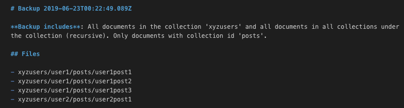

# Example Commands

The [example directory](../example) contains sample configuration, documents, index mappings, and JSON schemas that can be used to try out the commands.  The example uses [documents](../example/docs) in the following structure:

```
─ xyzposts          // contains public "post" documents
─ xyzusers          // contains "user" documents
    ├── user1
    │   └── posts   // contains user 1 "post" documents
    └── user2
        └── posts   // contains user 2 "post" documents
```

Index mappings [example/elasticsearch/indexMappings](../example/elasticsearch/indexMappings) and JSON Schemas [schemas](../example/schemas) are provided for `user` and `post` documents.

You can use the example with a test firestore database and/or a test Amazon elesticsearch instance. To use the examples, set up the key configuration in [Configuration](../README.md#Configuration) and then use the following example commands.  

These commands should be executed from the example directory.

## Example Configuration

The configuration is defined in two config files for demonstration purposes: `default.json` and `local-development.json`.  Note that an example `local-development.json` file is supplied in [example/config/example-local-development.json](../example/config/example-local-development.json).  Copy this to `local-development.json` and fill in the information for your environment.

### default.json

```javascript
{
  "debug": {
    "outputPath": "./debug"
  },
  "logger": {
    "prettyPrint": true
  },
  "elasticsearch": {
    "defaultIndex": "*",
    "indices": [
      {
        "name": "xyz_users",
        "docSetRef": "firestore.docSets.users",
        "indexMapping": "./elasticsearch/indexMappings/user.json",
        "search": {
          "sourceFields": ["fullName", "userid", "background"],
          "title": "User: '${_source.fullName}' (${_id})",
          "verboseDetails": "Userid: ${_source.userid}\n${_source.background}"
        }    
      },
      {
        "name": "xyz_posts",
        "docSetRef": "firestore.docSets.posts",
        "indexMapping": "./elasticsearch/indexMappings/post.json",
        "search": {
          "title": "Title: '${_source.title}' (${_id})",
          "verboseDetails": "Likes: ${_source.likes}\n${_source.article}"
        }
      },
      {
        "name": "xyz_user_posts",
        "docSetRef": "firestore.docSets.userPosts",
        "indexMapping": "./elasticsearch/indexMappings/post.json",
        "search": {
          "title": "Title: '${_source.title}' (${_id})",
          "verboseDetails": "Likes: ${_source.likes}\n${_source.article}"
        }
      }
    ]
  },
  "firestore": {
    "backupBasePath": "./backups",

    // "docSets" are shorthand references to sets of documents in firestore
    "docSets": {
      "all": {
        "path": null,
        "recursive": true
      },
      "posts": {
        "path": "xyzposts",
        "shallow": true
      },
      "userPosts": {
        "path": "xyzusers",
        "collectionId": "posts",
        "recursive": true
      },
      "users": {
        "path": "xyzusers",
        "shallow": true
      }
    },
    // "types" are used to map firestore reference id's / paths to types 
    // using regular expressions.  
    // Will look for matching type in "schemas" config entry.
    "types": [
      { "path": "^xyzposts\/[^/]+$", "type": "post" },
      { "path": "^xyzusers\/[^/]+\/posts\/[^/]+$", "type": "post" },
      { "path": "^xyzusers\/[^/]+$", "type": "user" }
    ]
  },
  "schemas": {
    "post": {
      "schemaId": "http://cloudlixyz.com/schemas/post.schema.json",
      // "schemaFiles" must include the main schema file and any referenced
      // schemas for the type
      "schemaFiles": [
        "./schemas/post.schema.json"
      ]
    },
    "user": {
      "schemaId": "http://cloudlixyz.com/schemas/user.schema.json",
      "schemaFiles": [
        "./schemas/user.schema.json"
      ]
    }
  }  
}
```

### local-development.json

```javascript
/**
 * Example of putting sensitive, environment-specific information in
 * a local-development config file.
 * 
 * Rename this to local-development (or local-environmentname) and fill in details.
 * 
 * Keyfile and service account files could be stored in a ./keys folder or other 
 * protected location. The .keys path should also be added to .gitignore so that 
 * the files are not added to source control.
 */
{
  // Required for firebase commands (and es:load-index and es:create-index-reload)
  "firebase": {
    "keyFilename": "path-to-your-project-firebase-adminsdk-keyfile.json",
    "databaseURL": "https://your-project-database-url.com",
    "projectId": "your-projectid"
  },

  // Required for elasticsearch commands
  "elasticsearch": {
    "serviceAccountFilename": "path-to-your-elasticsearch-service-account-file.json"
  }
}
```

## Schemas

The JSON Schemas for `post` and `user` documents are as follows.

### post

```javascript
{
  "$schema": "http://json-schema.org/draft-07/schema#",
  "$id": "http://cloudlixyz.com/schemas/post.schema.json",
  "type": "object",
  "title": "Post Schema",
  "description": "A public or private post",
  "required": [
    "title",
    "article",
    "likes"
  ],
  "properties": {
    "title": {
      "type": "string",
      "title": "The title of the post",
      "examples": ["The Lovesong of J. Alfred Prufrock"]
    },
    "article": {
      "type": "string",
      "title": "The post content",
      "examples": ["Let us go then, you and I,\nWhen the evening is spread out against the sky\nLike a patient etherized upon a table;"]
    },
    "likes": {
      "type": "integer",
      "minimum": 0,
      "title": "The number of likes for the post",
      "examples": [42]
    }
  },
  "additionalProperties": false
}
```

### user

```javascript
{
  "mappings": {
    "_doc": {
      "properties": {
        "userid": {
          "type": "keyword"
        },
        "fullName": {
          "type": "text"
        },
        "birthDate": {
          "type": "date"
        },
        "background": {
          "type": "text",
          "fields": {
            "english": {
              "type": "text",
              "analyzer": "english"
            }
          }
        }
      }
    }
  }
}
```

## Elasticsearch Index Mappings

The elasticsearch index mappings for `post` and `user` are as follows.

### post

```javascript
{
  "mappings": {
    "_doc": {
      "properties": {
        "title": {
          "type": "text",
          "fields": {
            "english": {
              "type": "text",
              "analyzer": "english"
            }
          }
        },
        "article": {
          "type": "text",
          "fields": {
            "english": {
              "type": "text",
              "analyzer": "english"
            }
          }
        },
        "likes": {
          "type": "integer"
        }  
      }
    }
  }
}
```

### user

```javascript
{
  "mappings": {
    "_doc": {
      "properties": {
        "userid": {
          "type": "keyword"
        },
        "fullName": {
          "type": "text"
        },
        "birthDate": {
          "type": "date"
        },
        "background": {
          "type": "text",
          "fields": {
            "english": {
              "type": "text",
              "analyzer": "english"
            }
          }
        }
      }
    }
  }
}
```


# Firestore Commands

The following commands require the firestore key to be configured.

## Upload sample documents

```
cloudli fire:upload docs/v1 --verbose
```


## Get a list of the user documents using a DocSet

```
cloudli fire:docs users
```


## Get the full user documents using a DocSet

```
cloudli fire:docs users --verbose
```


## Get a list of user documents using command line options instead of a DocSet

### users shallow

```
cloudli fire:docs -p xyzusers --shallow
```


### users recursive

```
cloudli fire:docs -p xyzusers --recursive
```


### user posts

This demonstrates using a recursive query with a specific collection id.  Note that this does not include the root `posts` collection.

```
cloudli fire:docs -p xyzusers --collectionId posts --recursive
```


### specific document

```
cloudli fire:docs -p xyzusers/user1/posts/user1post3 --verbose
```


## Backup the user posts using a DocSet

```
cloudli fire:backup userPosts --verbose
```


The resulting file structure:


The `backup-summary.md` file:




## Delete the user posts using a DocSet

```
cloudli fire:delete userPosts --verbose
```


Confirm the user posts were deleted:

```
cloudli fire:docs userPosts
```


## Restore the documents from the original backup

```
cloudli fire:restore backups/2019-06-23T00-22-49.089Z --verbose
```


## Compare the user posts with the local backup

```
cloudli fire:diff backups/2019-06-23T00-22-49.089Z userPosts
```


## Compare firestore user posts with other local files and generate diff html

The [docs/edited-user-posts](docs/edited-user-posts) directories contain modified user posts to demonstrate the use of `fire:diff`.

```
cloudli fire:diff docs/edited-user-posts userPosts --html
```


The resulting `./debug/2019-06-24T21-48-45.227Z.html`:


Note: You can also make changes manually using the [Firebase Console -> Database -> Cloud Firestore](https://console.firebase.google.com) and then run `fire:diff` using the original backup.

## Load an invalid user post

The [docs/invalid-user-posts](docs/invalid-user-posts) directory contains a new user post document that has invalid fields according to the JSON Schema for posts.

```javascript
xyzusers/user2/posts/user2post2

{
  poem: "Ulysses",
  likes: -1,
  article: "It little profits that an idle king,\n..."
}
```


Load this document that will be used to demonstrate schema validation.

```
cloudli fire:upload docs/invalid-user-posts --verbose
```


## Validate user posts

This command will display schema validation errors for the invalid document `xyzusers/user2/posts/user2post2`.

```
cloudli fire:validate userPosts
```


# Elasticsearch Commands

The following commands require the elasticsearch service account to be configured.  `es:load-index` and `es:create-reload-index` also require the firestore key to be configured.

## Create all indexes with aliases

```
cloudli es:create-index
```


# Load documents into the indexes

```
cloudli es:load-index --verbose
```


# Search all indexes

```
cloudli es:search like --verbose
```


# Search a specific index

Note that this uses English language stemming based on the indexMapping for `posts`. This allows the match of "renewing" given the search term of "renew".

```
cloudli es:search renew xyz_posts --verbose
```


# Get the full name for an index

```
cloudli es:get-aliases xyz_users
```


# Create new index version and reload documents

This command will create a new timestamp-based index using the current index mapping and will reload all documents from firestore for the related docSet in config.

**WARNING!**: This is destructive and will delete the current index if the document load is successful.

```
cloudli es:create-reload-index xyz_users --verbose
```


# Create new index version and reindex documents from the old index version

This command will create a new timestamp-based index using the current index mapping and will reload all documents from the old index version.

**WARNING!**: This is destructive and will delete the current index if the reindex is successful.

```
cloudli es:reindex xyz_users --verbose
```


