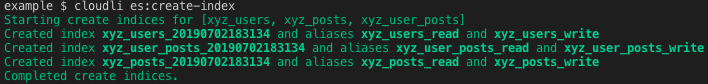

# Example Commands

The [example directory](../example) contains sample configuration, documents, index mappings, and JSON schemas that can be used to try out the commands.  The examples uses [documents](../example/docs) in the following structure:

```
─ xyzposts          // contains public "post" documents
─ xyzusers          // contains "user" documents
    ├── user1
    │   └── posts   // contains user 1 "post" documents
    └── user2
        └── posts   // contains user 1 "post" documents
```

Index mappings [example/elasticsearch/indexMappings](../example/elasticsearch/indexMappings) and JSON Schemas [schemas](../example/schemas) are provided for `user` and `post` documents.

You can use the example with a test firestore database and/or a test Amazon elesticsearch instance. To use the examples, set up the key configuration in [Configuration](../README.md#Configuration) and then use the following example commands.  

These commands should be executed from the example directory.

# Firestore Commands

The following commands require the firestore key to be configured.

## Upload sample documents

```
cloudli fire:upload docs/v1 --verbose
```


## Get a list of the user documents using a DocSet

```
cloudli fire:docs users
```


## Get the full user documents using a DocSet

```
cloudli fire:docs users --verbose
```


## Backup the user posts using a DocSet

```
cloudli fire:backup userPosts --verbose
```


The resulting file structure:


The `backup-summary.md` file:


## Delete the user posts using a DocSet

```
cloudli fire:delete userPosts --verbose
```


Confirm the user posts were deleted:

```
cloudli fire:docs userPosts
```


## Restore the documents from the original backup

```
cloudli fire:restore backups/2019-06-23T00-22-49.089Z --verbose
```


## Compare the user posts with the local backup

```
cloudli fire:diff backups/2019-06-23T00-22-49.089Z userPosts
```


## Compare firestore user posts with other local files and generate diff html

The [docs/v2](docs/v2) directories contain modified user posts to demonstrate the use of diff

```
cloudli fire:diff docs/v2 userPosts --html
```


The resulting `./debug/2019-06-23T01-04-56.729Z.html`:


Note: You can also make changes manually using the [Firebase Console -> Database -> Cloud Firestore](https://console.firebase.google.com) and then run fire:diff using the original backup.

# Elasticsearch Commands

The following commands require the elasticsearch service account to be configured.  `es:load-index` and `es:create-reload-index` also require the firestore key to be configured.

## Create all indexes with aliases

```
cloudli es:create-index --addIndexes
```



# Load documents into the indexes

```
cloudli es:load-index --verbose
```


# Search the indexes

```
cloudli es:search like --verbose
```


